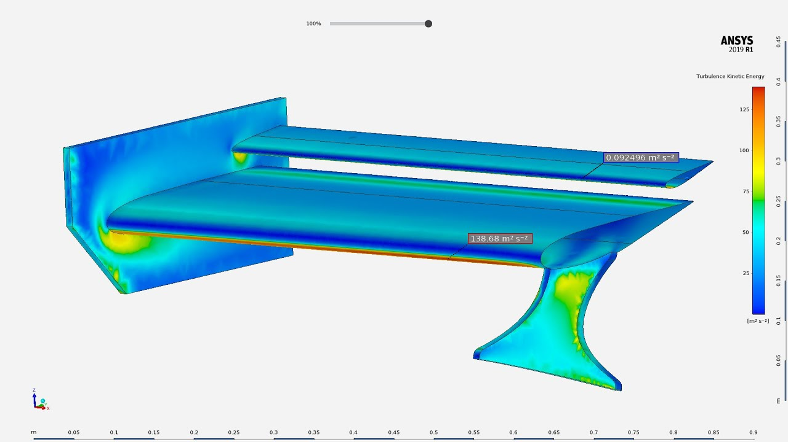

## Project Overview
Goal: produce ~30 lb downforce at 30 mph with practical manufacturability and mounting stiffness.

**Approach**
- Airfoil selection (high Cl/low Cd at low Re), 2-element baseline with simple endplates.
- CFD (XFLR5/Ansys) sweep across AoA; tuned for 30 mph target; validated sensitivity to ride height and yaw.
- Quick FEA check on mounts/struts for static load + 2× safety.

**Results**
- Predicted downforce: ~30–34 lb @ 30 mph (AoA 8–10°).
- Drag penalty acceptable (ΔCd small vs total tractive capacity in autocross).
- Mount deflection & fastener shear within limits.

## Images
Place more images in this folder and reference them:

## Notes
- Future: endplate vortex control, multi-element flap adjuster, wind-tunnel calibration.
